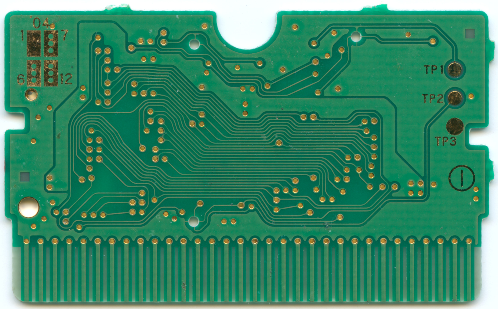

# AGB-E05-01

Board has ROM-chip, flash chip for saves and RTC. Used for third gen pokemon games(Ruby, Sapphire and Emerald) 

[PCB layout and schematic](/general/boards/AGB-E05-01/)

## ROM chips

### 64M (Pokemon Ruby and Sapphire)

- MX23L6407-12C [datasheet for similar chip](./datasheets/MX23L6410_MacronixInternational.pdf)

### 128M (Pokemon Emerald)

- MX23L12807-12C

# Used sources

 - [Board photo](https://www.reddit.com/r/Gameboy/comments/kqqv8y/so_ive_got_this_pokemon_ruby_cartridge_when_i/)
 - [Board photos without elements](https://archive.org/details/agb-e-05-01/000_thumbnail_back.jpg)